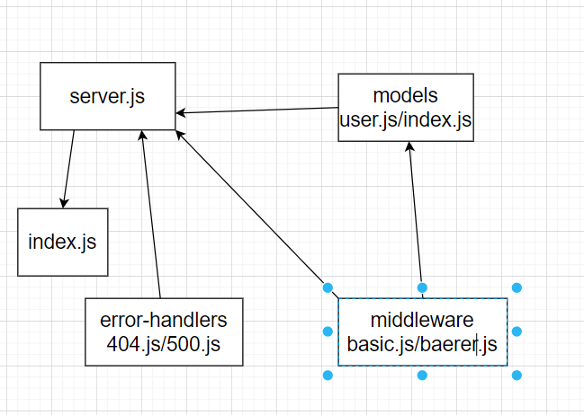

# bearer-auth

[heroku link](https://leen-bearer-auth.herokuapp.com/)

https://leen-bearer-auth.herokuapp.com/signup >>> add username and password >>>  **POST**
https://leen-bearer-auth.herokuapp.com//signin >>> signin with the username and password >>> **POST**
https://leen-bearer-auth.herokuapp.com/user >>> add token >>> **GET**

[pull link](https://github.com/leenahmad/bearer-auth/pull/1)

[action link](https://github.com/leenahmad/bearer-auth/actions)

## UML 

